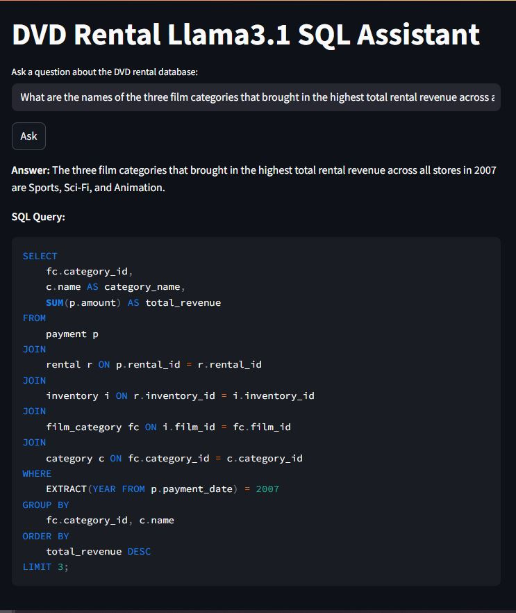
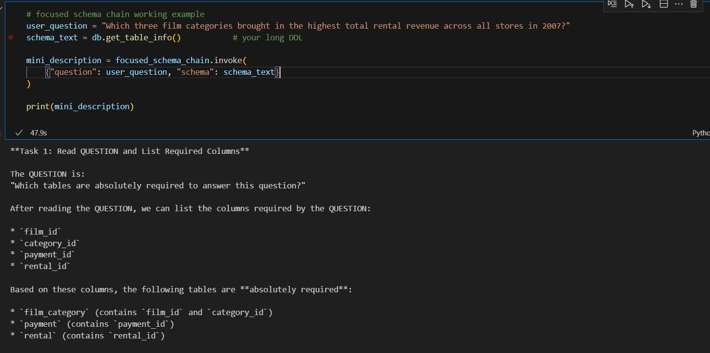
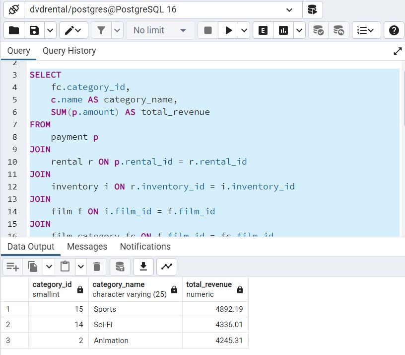

# 🐬 Query-your-PostgreSQL DB with LangChain + Llama 3 (Notebook Edition)

Leverage a local Llama 3 LLM with LangChain to perform on-the-fly schema pruning, deterministic text-to-SQL synthesis, against PostgreSQL DB so every natural-language query compiles into precise, production-ready SQL and returns the results in seconds.

A **single Jupyter notebook** that lets you:

1. Load the **DVD Rental** sample database (provided as a `.tar` dump).  
2. Ask natural-language questions.  
3. Watch Llama 3 (running locally via **Ollama**) write SQL, run it on Postgres, and give you a plain-English answer **plus** the query.


---

## 📁 Project layout

```
.
├─ notebook/
│   └─ dvd-rental-llama.sql.ipynb   ← main demo notebook
├─ data/
│   └─ dvdrental.tar                ← PostgreSQL dump of DVD Rental DB
├─ requirements.txt                 ← minimal deps for the notebook
├─ app.py                           ← optional Streamlit app
└─ README.md
```

---
## 🚀 Quick start

### 0 · Prerequisites

| Tool            | Version   | Notes                                                |
|-----------------|-----------|------------------------------------------------------|
| **Python**      | 3.8-3.11  | use `venv` or Conda                                  |
| **PostgreSQL**  | ≥ 13      | local server or Docker                               |
| **Ollama**      | latest    | `curl -fsSL https://ollama.ai/install.sh \| sh`      |
| **Jupyter Lab** | any       | installed via `pip` requirements                     |

### 1 · Install **Ollama** & pull Llama 3  
```bash
ollama pull llama3.1                                   # 8-B model (≈8 GB)
``` 

### 1 · Clone & install
```bash
git clone https://github.com/your-user/llama-dvd-rental.git
cd llama-dvd-rental
python -m venv .venv && source .venv/bin/activate
pip install -r requirements.txt
```

### 2 · Restore the sample database
```bash
createdb dvdrental
pg_restore -U <pg_user> -d dvdrental data/dvdrental.tar
```

### 4 · Launch the notebook
```bash
jupyter lab notebook/dvd-rental-llama.sql.ipynb
```
Run the cells from top to bottom.

### Optional: Run as a Streamlit App

You can use the same logic in a web UI with Streamlit.

1. **Install Streamlit** (if not already):
    ```bash
    pip install streamlit
    ```

2. **Run the app:**
    ```bash
    streamlit run app.py
    ```

3. **Open the browser** at the link shown (usually http://localhost:8501).

The Streamlit app shows the ER diagram and lets you ask questions in a simple web form.



---

---
## What you’ll see







## 🔍 How it works (inside the notebook)

1. **Focused-schema prompt** – Reads the question first, trims the giant DDL to only the tables/columns required.  
2. **`create_sql_query_chain`** – Generates deterministic SQL from that brief.  
3. **`exec_sql()`** – Strips code fences/labels, runs the query, captures rows.  
4. **Answer prompt** – Asks Llama 3 to return a SQL block **plus** a narrative answer.  
5. **`full_chain`** – Pipes everything together in one LangChain pipeline.

---

## 🛠️ Customising

* Swap `OLLAMA_MODEL` for any model you have in Ollama (`llama3.1:70b`, `phi3`, etc.).  
* Use any Postgres database, the schema introspection is automatic.  
* Edit prompts directly inside the notebook cells to suit your style.